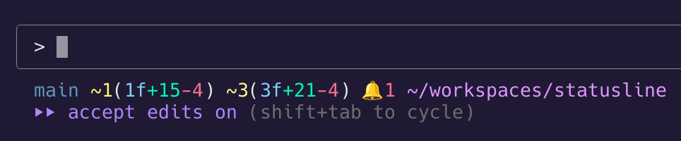

# Claude Code Custom Statusline

Enhanced statusline for [Claude Code](https://claude.ai/code) with Git status, GitHub notifications, and smart path display.

## Examples



**Format**: `[branch] [staged] [unstaged] [path]` (+ optional GitHub notifications)

```bash
~/project                                        # Clean, no git repo
main ~/project                                   # Clean, no changes
main ~1(1f+189-16) ~1(1f+242) ~/project          # Detailed git stats
main ~1(1f+189-16) ~1(1f+242) 🔔3 ~/project      # + GitHub notifications (optional)
```

## Installation

**Required**: Go 1.25+

1. **Place the file**

   ```bash
   cp statusline.go ~/.claude/
   ```

2. **Configure Claude Code** (edit `~/.claude/settings.json`)

   ```json
   {
     "statusLine": {
       "type": "command",
       "command": "go run ~/.claude/statusline.go"
     }
   }
   ```

## GitHub Integration (Optional)

1. **Create token**: [GitHub Settings](https://github.com/settings/tokens) → Generate → Select `notifications`

2. **Create `~/.claude/.env` file**:

   ```bash
   # ~/.claude/.env
   GITHUB_TOKEN=ghp_your_token_here
   SHOW_GITHUB_NOTIFICATIONS=true
   ```

## Format

| Symbol     | Meaning                     |
| ---------- | --------------------------- |
| `+N`       | N added files               |
| `~N`       | N modified files            |
| `-N`       | N deleted files             |
| `(NfM+L-)` | N files, M+ lines, L- lines |
| `🔔N`      | N GitHub notifications      |

**Order**: Staged changes first, then unstaged changes

## Cache

GitHub API calls cached in `~/.statusline_cache` for 5 minutes:

```json
{
  "timestamp": "2025-08-20T05:08:17+09:00",
  "key": "github_notifications",
  "content": "1"
}
```
